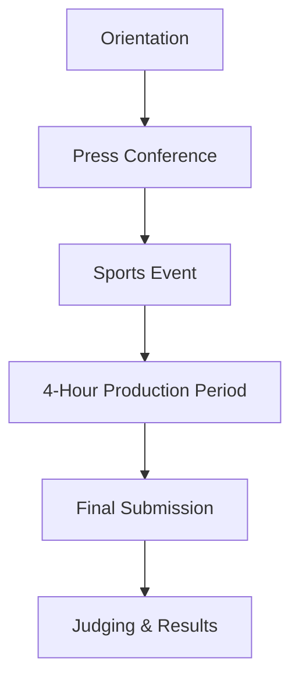

This section contains the official rules, requirements, and procedures for the Online Publishing Contest, based on the guidelines for the National Schools Press Conference.

## 🔑 Key Information

- **Time Limit**: 4 hours for writing, layout, and editing (excluding data gathering)
- **Team Size**: 5 members per team for both English and Filipino categories at Secondary level
- **Output**: Single live website URL (e.g., WordPress site)
- **Critical Rule**: Use pen names only - no real names in publication

## Pre-Contest Requirements

### 👔 Attire
- Contestants must wear a **plain white shirt**
- School identification card must be visible at all times

### 📢 Orientation
- All contestants are **required** to attend the orientation before the competition begins
- Contest specifics including number and type of articles will be announced during orientation

### 💻 Laptop Clearing
- All official laptops must be submitted to the TWG (Technical Working Group)
- Laptops will be cleared of any stored documents or pre-written materials
- **Deadline**: Must be completed by the specified time (announced during orientation)

## Contest Proper

### 🔐 Quarantine Rules
::caution
**Strict Quarantine**

- Use of pen names is **mandatory**
- No identifying information (real names, school, division) allowed
::

## ⏰ Important Deadlines

::note
**Critical Deadlines**

- **Laptop Clearing**: Must be completed before contest begins
- **Final Submission**: URL must be emailed to assigned examiner within the 4-hour limit
- **Late Submissions**: Not accepted under any circumstances
::

## 📅 Timeline

